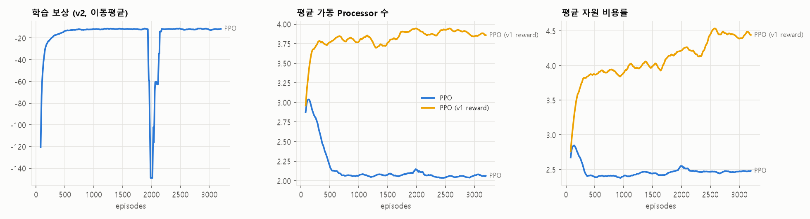

# DEVS 기반 동적 생산공정 파라미터 최적화 (PPO)

## 📌 프로젝트 개요
DEVS(xdevs) 기반 다중 설비 생산공정 시뮬레이션에서 공정 상태를 일정 주기마다 관측하고, 강화학습(PPO)이 운영 파라미터를 동적으로 조절하는 프로젝트입니다.

```
공정 상태 수집 → AI가 운영 파라미터 결정 → DEVS 시뮬레이션(Δt=10) → KPI·보상 계산 → 다음 의사결정
```

주요 내용
1. AI 제어변수와 환경변수 분리
2. 시뮬레이션 도중 상태를 보고 파라미터를 바꾸는 동적 최적화
3. 자원 비용이 포함된 trade-off 보상 설계
4. 수요 급증 / 설비 성능 저하 시나리오에서 정적 최적 조합과 비교·검증

---

## 🏗 시스템 구성

```
                 in_ctrl (Control 메시지, 10 time마다 외부 이벤트로 주입)
        ┌──────────────┬──────────────┬─────────────────────┐
        ▼              ▼              ▼                     ▼
Generator ──▶ Release ──▶ Buffer ──▶ Processor0..3 ──▶ Collector
(수요 발생)   (작업 투입)   (대기·할당)   (가공)              (KPI 수집)
```

| 컴포넌트 | 역할 |
|---|---|
| Generator | 시간가변 도착률 λ(t)의 비정상 포아송 과정(thinning)으로 주문 생성 |
| Release | 주문 Backlog를 보관하고 최소 `release_interval` 간격으로 공정에 투입 |
| Buffer | FIFO 대기열 + 디스패처. 가동 대수·할당 정책에 따라 유휴 Processor에 작업 전달 |
| Processor ×4 | 처리시간 = size / (service_rate × health(t)) × noise. 최대 4대를 만들어 두고 가동 여부는 Buffer가 제어 |
| Collector | 완료 작업의 타임스탬프(도착·투입·시작·완료)를 수집 |

AI의 결정은 루트 Coupled 모델의 입력 포트 `in_ctrl`로 DEVS 외부 이벤트(`Coordinator.inject`)로 들어가 각 원자 모델에 전파됩니다. 진행 중인 작업은 기존 조건을 유지하고, 새 조건은 다음 작업부터 적용됩니다.

### 제어변수 vs 환경변수

| 구분 | 변수 | 범위 / 내용 |
|---|---|---|
| AI 제어변수 | Service Rate | 0.7 ~ 1.2 (전 설비 공통 처리 속도) |
| | Active Server 수 | 1 ~ 4대 |
| | Release Interval | 0.05 ~ 1.0 (작업 투입 최소 간격) |
| | Dispatching Policy | `INDEX`(고정 순서) / `HEALTH`(관측 성능이 높은 설비 우선) |
| 환경변수 | Demand Arrival | 평상시 λ=1.5, 시나리오에 따라 변동 |
| | Job Size | N(1.0, 0.2²) |
| | Processing Noise | lognormal, CV 0.1 |
| | Machine Degradation | 특정 Processor의 성능 배율 저하 (AI는 직접 볼 수 없고 처리시간으로만 추정) |

### 상태 · 행동 · 보상

- State (15차원): Queue, Backlog, WIP, Utilization, Throughput, AvgWaitingTime, ArrivalRate, ArrivalTrend(EWMA), 현재 ActiveServers/ServiceRate/ReleaseInterval, 설비별 성능 추정치 ×4 (실측 처리시간 ÷ 예상 처리시간의 EWMA)
- Action: [ServiceRate, ActiveServers, ReleaseInterval, Dispatch]
- Reward (구간마다):

$$R_t = w_1 T - w_2 W - w_3 \mathrm{WIP} - w_4 C - w_5 V$$

| 항 | 정의 | 가중치 |
|---|---|---|
| T | 구간 완료 작업 수 / Δt | 1.0 |
| W | 대기 누적량 / Δt (= 시간평균 대기 작업 수, Little의 법칙상 λ×평균 대기시간) | 0.3 |
| WIP | 공정 내 시간평균 재공 (Buffer + 가공 중) | 0.2 |
| C | 자원 비용률 = Σ_가동설비 (0.5 + 0.5 × rate²) — 가동 고정비 + 속도에 따른 에너지/마모비 | 0.5 |
| V | SLA(사이클타임 ≤ 5) 위반 비율 + WIP 상한(8) 초과분 | 2.0 |

비용 계수는 "평상시 최적 = 2대×고속, 수요 급증 시 최적 = 3대"가 되도록 정적 grid 분석으로 보정했습니다. 즉 하나의 고정 조합으로는 두 상황을 모두 최적으로 운영할 수 없는 구조입니다.

### 시나리오

| Scenario | 내용 |
|---|---|
| Normal | λ=1.5 일정, 모든 설비 정상 |
| Demand Surge | t=200~400 구간 수요 +30% (λ=1.95) |
| Machine Degradation | t≥200부터 Processor0 성능 -30% |

학습 시에는 세 시나리오를 매 에피소드 무작위로 섞고, 변동 시점·크기·대상 설비·기본 수요(±10%)도 랜덤화해 특정 시점을 외우지 못하게 했습니다. 평가는 고정 시나리오 × 30개 시드로 수행합니다.

### PPO
- PyTorch Actor-Critic, PPO-Clip, GAE(γ=0.95, λ=0.9), 업데이트당 8 에피소드(480 step), 총 400 업데이트(3,200 에피소드)
- 조건부 혼합 행동: 이산 행동(가동 대수·디스패칭)을 먼저 샘플링하고, 연속 행동(속도·투입간격)은 선택된 가동 대수를 입력으로 받아 결정

---

## 🏆 실험 결과

모든 방법은 같은 시드(공통 난수)에서 같은 trade-off 보상으로 채점했습니다. 상세 결과는 [results/results.md](results/results.md)에 있습니다.

| Method | 설명 |
|---|---|
| Fixed | 현장 기준 조건: 2대, 속도 1.0, 즉시 투입, 고정 순서 할당 |
| Static-Opt | 고정 조합 108개 × 16 에피소드 Grid Search → 2대, 속도 1.2, HEALTH 할당 |
| PPO | 10 time마다 상태를 보고 파라미터를 결정 |

### 방법별 KPI (3개 시나리오 평균)

| Method | Throughput ↑ | Waiting ↓ | WIP ↓ | Resource Cost ↓ | SLA Violation ↓ | Reward ↑ |
|---|---|---|---|---|---|---|
| Fixed | 1.537 | 1.407 | 3.80 | 2.000 | 9.82% | -71.80 |
| Static-Opt | 1.538 | 0.345 | 1.82 | 2.440 | 0.25% | -12.81 |
| PPO | 1.539 | 0.286 | 1.73 | 2.482 | 0.01% | -10.95 |

### 시나리오별 보상 (mean ± std)

| Scenario | Fixed | Static-Opt | PPO |
|---|---|---|---|
| Normal | -20.22 ± 10.66 | -10.88 ± 1.83 | -10.79 ± 1.94 |
| Demand Surge | -116.16 ± 94.65 | -16.38 ± 10.03 | -11.00 ± 2.53 |
| Machine Degradation | -79.01 ± 52.76 | -11.18 ± 1.92 | -11.06 ± 1.87 |

Demand Surge 상세 (Static-Opt → PPO): 평균 대기시간 0.483 → 0.348 (-28%), SLA 위반 0.69% → 0.01%, WIP 2.15 → 1.94, 자원 비용 2.440 → 2.515 (+3%)


### 결과 해석
- 평상시·설비 저하에서는 PPO ≈ Static-Opt. 두 방법 모두 "2대 × 최고속 + HEALTH 할당"에 수렴했습니다. 설비 저하는 HEALTH 할당만으로 대응되어 성능이 떨어진 P0의 분담이 1%로 줄고 다른 설비가 작업을 넘겨받습니다(Fixed는 P0가 42%를 계속 처리).
- 수요 급증에서 차이가 납니다. PPO는 큐가 쌓이는 구간에만 3번째 설비를 일시적으로 가동하고 해소되면 다시 2대로 줄입니다. 비용을 3%만 늘려 대기시간을 28% 줄였고 성능 편차(std 10.0 → 2.5)도 크게 줄었습니다.
- 다만 학습된 정책은 "급증 구간 동안 3대를 계속 운영"하는 형태가 아니라 큐 상태에 반응해 짧게 증설하는 형태입니다 (급증 구간 평균 가동 대수 2.2대). 수요 변화 자체보다 그 결과로 나타나는 대기열에 반응하는 정책을 학습한 것으로 보입니다.

---

## 🧗 개발 중 부딪힌 문제와 대응

### 1. 성능 지표만 보상하면 자원 상한으로 수렴 (보상 설계 v1 → v2)
처음에는 처리량과 대기시간만 보상(`--reward performance`)으로 사용했습니다. 그 결과 정책이 가동 대수 4대(상한) 로 수렴했습니다. 성능 향상에 대한 보상만 있고 자원 사용 비용이 없었기 때문입니다. 자원 비용·WIP·제약 위반을 추가한 v2 보상으로 재설계했습니다.

| Reward | 평균 가동 대수 | 평균 Service Rate | Waiting ↓ | Resource Cost ↓ | Reward(v2 기준) ↑ |
|---|---|---|---|---|---|
| v1: T − W | 4.00 | 1.160 | 0.013 | 4.691 | -65.39 |
| v2: T − W − WIP − C − V | 2.05 | 1.195 | 0.286 | 2.482 | -10.95 |

v1 정책은 대기시간이 거의 0이지만 자원 비용이 v2보다 89% 높습니다.



### 2. 이산·연속 행동을 독립적으로 뽑으면 "3대 × 저속"에 고착
처음에는 가동 대수와 Service Rate를 서로 독립적인 분포에서 샘플링했습니다. 이 구조에서 PPO는 학습 초반부터 항상 3대 × 속도 0.85에 고착됐습니다(로그: `runs/train_tradeoff_v0_independent_action.log`). "2대로 줄이려면 속도를 함께 올려야 하는데" 독립 샘플링에서는 2대 + 저속 조합이 주로 뽑혀 과부하 페널티를 받았고, 그래서 2대 자체를 기피하게 된 것입니다.
→ 연속 행동을 선택된 가동 대수에 조건부로 결정하는 구조로 바꾸자 2대 × 고속 운영을 찾았고, 필요할 때만 3대로 늘리는 정책을 학습했습니다.

### 3. 학습 불안정
v2 학습 중 약 2,000 에피소드 부근에서 정책이 일시적으로 붕괴했다가 회복했습니다(학습 곡선 급락 구간). 학습률 감쇠나 KL 기반 조기 종료로 개선할 여지가 있습니다.

---

## ⚙️ 실행 방법

```bash
pip install -r requirements.txt      # xdevs, numpy, torch, matplotlib

python main.py                        # 전체 파이프라인 (Grid Search → PPO v1/v2 학습 → 평가)

# 단계별 실행
python baselines.py                   # Static-Opt Grid Search → runs/static_opt.json (약 3분)
python train_ppo.py --reward tradeoff     # → runs/ppo_tradeoff/ (약 11분, CPU)
python train_ppo.py --reward performance  # → runs/ppo_performance/
python evaluate.py                    # → results/results.md, results/*.png
```

## 📂 파일 구성

| 파일 | 설명 |
|---|---|
| `xdevs_Job.py` | Job(타임스탬프 포함), Control(제어 메시지), TimeAvg(시간가중 평균 누적기) |
| `xdevs_Gen.py` | 수요 Generator (비정상 포아송) |
| `xdevs_Release.py` | 작업 투입 모델 (Release Interval) |
| `xdevs_Buffer.py` | 대기열 + 디스패처 (가동 대수, INDEX/HEALTH 정책) |
| `xdevs_Proc.py` | Processor (Service Rate, 처리 노이즈, 성능 저하) |
| `xdevs_Coll.py` | 완료 작업 수집 |
| `xdevs_Coupled.py` | 전체 Coupled DEVS 모델 + 제어 입력 포트 |
| `scenarios.py` | 환경변수와 Normal / Demand Surge / Machine Degradation 시나리오 |
| `gbp_env.py` | 강화학습 환경: 단계별 시뮬레이션, 상태 관측, 보상, KPI |
| `PPO.py` | PyTorch PPO Actor-Critic (조건부 혼합 행동) |
| `train_ppo.py` | PPO 학습 스크립트 |
| `baselines.py` | Fixed / Static-Opt(Grid Search) baseline |
| `evaluate.py` | 시나리오별 비교 평가, 표·그림 생성 |

## 📚 참고
- xdevs (Python DEVS): https://github.com/iscar-ucm/xdevs.py
- Schulman et al., *Proximal Policy Optimization Algorithms*, arXiv:1707.06347
