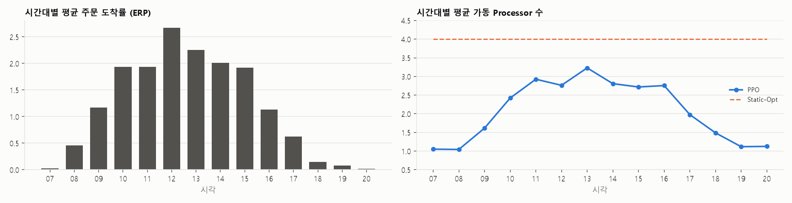
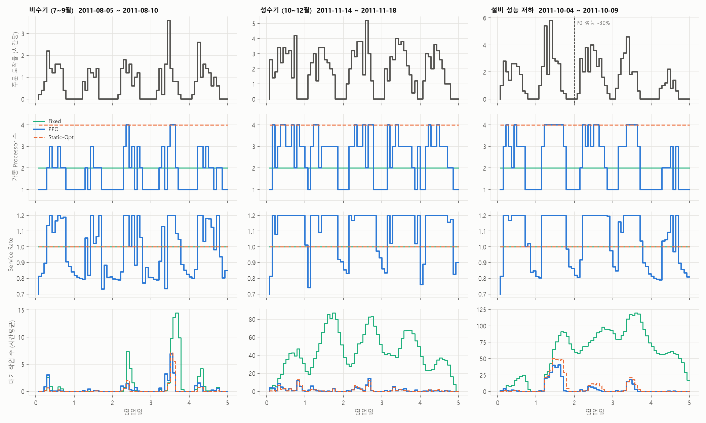
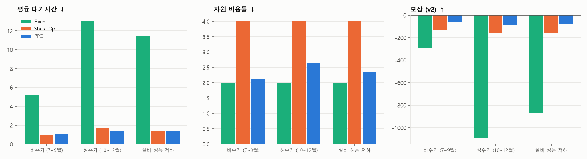

# DEVS 기반 동적 생산공정 파라미터 최적화 (PPO)

## 📌 프로젝트 개요
DEVS(xdevs) 기반 다중 설비 생산공정 시뮬레이션에서 공정 상태를 일정 주기마다 관측하고, 강화학습(PPO)이 운영 파라미터를 동적으로 조절하는 프로젝트입니다. 수요(주문 도착 시각·작업량)는 실제 ERP 주문 데이터를 재생해 사용합니다.

```
ERP 주문 → 공정 상태 수집 → AI가 운영 파라미터 결정 → DEVS 시뮬레이션(1시간) → KPI·보상 계산 → 다음 의사결정
```

주요 내용
1. AI 제어변수와 환경변수 분리
2. 실제 ERP 주문 데이터 기반 수요 (시간대·계절 변동 포함)
3. 시뮬레이션 도중 상태를 보고 파라미터를 바꾸는 동적 최적화
4. 자원 비용이 포함된 trade-off 보상 설계
5. 비수기 / 성수기 / 설비 성능 저하 조건에서 정적 최적 조합과 비교·검증

---

## 🗂 ERP 데이터

| 항목 | 내용 |
|---|---|
| 원천 | [UCI Online Retail II](https://archive.ics.uci.edu/dataset/502/online+retail+ii) — 영국 온라인 도매업체의 실거래 주문 (2009-12 ~ 2011-12), CC BY 4.0 |
| 정제 | 주문 라인 1,067,371건 → 취소·반품·수량/단가 ≤ 0·중복 제외 → 주문 40,077건 (`data/erp_orders.csv`) |
| 형식 | `order_id, order_datetime, customer_id, country, n_lines, quantity` (ERP 주문 export 형식) |
| 로트 분할 | 주문 수량이 800개(상위 5% 지점)를 넘으면 균등 분할 → 로트 44,605개 |
| Job Size | 로트 수량 ÷ 학습 기간 평균 로트 수량 (평균 1.0) |
| 시간축 | 영업일 07:00~21:00만 이어 붙임. 1 영업일 = 70 sim time (1 sim time = 12분) |
| 분할 | 학습: 2009-12 ~ 2011-06 (466 영업일), 평가: 2011-07 ~ 2011-12 (138 영업일 → 5일 구간 27개) |

주문은 07~09시와 18시 이후에 거의 없고 12시에 가장 많이 들어옵니다. 11월 주문량은 1월의 약 2.5배입니다. 이 시간대·계절 변동이 그대로 시뮬레이션 수요가 됩니다.

다른 ERP 데이터를 쓰려면 위 형식으로 export한 CSV를 `data/erp_orders.csv`에 두면 됩니다.

---

## 🏗 시스템 구성

```
                 in_ctrl (Control 메시지, 1시간마다 외부 이벤트로 주입)
        ┌──────────────┬──────────────┬─────────────────────┐
        ▼              ▼              ▼                     ▼
Generator ──▶ Release ──▶ Buffer ──▶ Processor0..3 ──▶ Collector
(ERP 주문)    (작업 투입)   (대기·할당)   (가공)              (KPI 수집)
```

| 컴포넌트 | 역할 |
|---|---|
| Generator | ERP 주문 데이터의 도착 시각·작업량 그대로 Job 생성 |
| Release | 주문 Backlog를 보관하고 최소 `release_interval` 간격으로 공정에 투입 |
| Buffer | FIFO 대기열 + 디스패처. 가동 대수·할당 정책에 따라 유휴 Processor에 작업 전달 |
| Processor ×4 | 처리시간 = size / (service_rate × health(t)) × noise. 최대 4대를 만들어 두고 가동 여부는 Buffer가 제어 |
| Collector | 완료 작업의 타임스탬프(도착·투입·시작·완료)를 수집 |

AI의 결정은 루트 Coupled 모델의 입력 포트 `in_ctrl`로 DEVS 외부 이벤트(`Coordinator.inject`)로 들어가 각 원자 모델에 전파됩니다. 진행 중인 작업은 이전 조건을 유지하고, 새 조건은 다음 작업부터 적용됩니다.

### 제어변수 vs 환경변수

| 구분 | 변수 | 범위 / 내용 |
|---|---|---|
| AI 제어변수 | Service Rate | 0.7 ~ 1.2 (전 설비 공통 처리 속도) |
| | Active Server 수 | 1 ~ 4대 |
| | Release Interval | 0.05 ~ 1.0 (작업 투입 최소 간격) |
| | Dispatching Policy | `INDEX`(고정 순서) / `HEALTH`(관측 성능이 높은 설비 우선) |
| 환경변수 | Demand Arrival | ERP 주문 도착 시각 |
| | Job Size | ERP 주문 수량 기반 |
| | Processing Noise | lognormal, CV 0.1 |
| | Machine Degradation | 특정 Processor의 성능 배율 저하 (AI는 직접 볼 수 없고 처리시간으로만 추정) |

### 상태 · 행동 · 보상

- State (15차원): Queue, Backlog, WIP, Utilization, Throughput, AvgWaitingTime, ArrivalRate, ArrivalTrend(EWMA), 현재 ActiveServers/ServiceRate/ReleaseInterval, 설비별 성능 추정치 ×4 (실측 처리시간 ÷ 예상 처리시간의 EWMA)
- Action: [ServiceRate, ActiveServers, ReleaseInterval, Dispatch]
- Reward (1시간마다):

$$R_t = w_1 T - w_2 W - w_3 \mathrm{WIP} - w_4 C - w_5 V$$

| 항 | 정의 | 가중치 |
|---|---|---|
| T | 구간 완료 작업 수 / Δt | 1.0 |
| W | 대기 누적량 / Δt (= 시간평균 대기 작업 수, Little의 법칙상 λ×평균 대기시간) | 0.3 |
| WIP | 공정 내 시간평균 재공 (Buffer + 가공 중) | 0.2 |
| C | 자원 비용률 = Σ_가동설비 (0.5 + 0.5 × rate²) — 가동 고정비 + 속도에 따른 에너지/마모비 | 0.5 |
| V | SLA(사이클타임 ≤ 5 sim time = 1시간) 위반 비율 + WIP 상한(8) 초과분 | 2.0 |

### 학습 · 평가 조건

| 구분 | 내용 |
|---|---|
| 학습 | 학습 기간에서 임의의 5영업일 구간. 절반 확률로 임의 설비·시점·크기(-20~-40%)의 성능 저하 추가 |
| 평가: 비수기 | 2011-07 ~ 09 구간, ERP 수요 그대로 |
| 평가: 성수기 | 2011-10 ~ 12 구간, ERP 수요 그대로 |
| 평가: 설비 성능 저하 | 평가 기간 전체 구간, 3일차부터 Processor0 성능 -30% |

### PPO
- PyTorch Actor-Critic, PPO-Clip, GAE(γ=0.95, λ=0.9), 업데이트당 8 에피소드(560 step), 총 400 업데이트(3,200 에피소드)
- 조건부 혼합 행동: 이산 행동(가동 대수·디스패칭)을 먼저 샘플링하고, 연속 행동(속도·투입간격)은 선택된 가동 대수를 입력으로 받아 결정

---

## 🏆 실험 결과

평가 기간 27개 구간 × 3개 시드에서, 모든 방법을 같은 구간·같은 난수·같은 trade-off 보상으로 채점했습니다. 상세 결과는 [results/results.md](results/results.md)에 있습니다.

| Method | 설명 |
|---|---|
| Fixed | 현장 기준 조건: 2대, 속도 1.0, 즉시 투입, 고정 순서 할당 |
| Static-Opt | 고정 조합 108개 × 16 에피소드 Grid Search (학습 기간) → 4대, 속도 1.0, 투입간격 0.25, HEALTH 할당 |
| PPO | 1시간마다 상태를 보고 파라미터를 결정 |

### 방법별 KPI (전체 평균)

| Method | Throughput ↑ | Waiting ↓ | WIP ↓ | Resource Cost ↓ | SLA Violation ↓ | Reward ↑ |
|---|---|---|---|---|---|---|
| Fixed | 1.135 | 9.919 | 15.19 | 2.000 | 53.13% | -745.49 |
| Static-Opt | 1.171 | 1.333 | 2.49 | 4.000 | 11.37% | -149.22 |
| PPO | 1.171 | 1.296 | 2.23 | 2.339 | 10.89% | -77.66 |

Static-Opt → PPO: 자원 비용 -42%, WIP -10%, 대기시간 -3%, SLA 위반 11.37% → 10.89%

### 구간별 보상 (mean ± std)

| 구간 | Fixed | Static-Opt | PPO |
|---|---|---|---|
| 비수기 (7~9월) | -294.56 ± 250.45 | -130.77 ± 60.72 | -62.98 ± 34.47 |
| 성수기 (10~12월) | -1090.88 ± 617.87 | -161.85 ± 79.09 | -89.72 ± 53.20 |
| 설비 성능 저하 | -872.00 ± 875.42 | -155.01 ± 81.38 | -81.44 ± 49.85 |





### 결과 해석
- PPO는 하루 주문 패턴에 맞춰 설비를 조절합니다. 주문이 거의 없는 07~08시와 19시 이후에는 평균 1.1대, 주문이 몰리는 11~16시에는 2.7~3.2대를 가동합니다. 반면 정적 최적 조합은 피크를 버티기 위해 하루 종일 4대를 가동합니다.
- 그 결과 대기시간·WIP·SLA 위반을 Static-Opt와 같거나 더 낮게 유지하면서 자원 비용을 42% 줄였습니다.
- 성수기에는 PPO가 대기시간(-15%)과 SLA 위반(14.05% → 11.99%)도 더 낮습니다. 비수기에는 비용을 47% 줄이는 대신 대기시간이 13% 늘었습니다(0.976 → 1.103).
- 설비 성능 저하 구간에서 Fixed는 성능이 떨어진 P0가 작업의 43%를 계속 처리합니다. PPO는 20%, Static-Opt는 12%로 낮췄습니다. PPO는 HEALTH 할당을 일관되게 선택하지 않아 Static-Opt보다 P0를 더 많이 씁니다.
- SLA 위반은 PPO와 Static-Opt 모두 약 11%로 남습니다. SLA(1시간)에 비해 실제 주문이 몇십 분 안에 몰려 들어오는 경우가 많기 때문입니다.

---

## ⚙️ 실행 방법

```bash
pip install -r requirements.txt      # xdevs, numpy, torch, matplotlib, pandas, openpyxl

# (선택) ERP 주문 CSV 다시 만들기 — data/erp_orders.csv는 저장소에 포함되어 있음
#   https://archive.ics.uci.edu/dataset/502/online+retail+ii 에서 받은 online_retail_II.xlsx를 data/raw/에 두고
python erp_data.py data/raw/online_retail_II.xlsx

python main.py                        # 전체 파이프라인 (Grid Search → PPO v1/v2 학습 → 평가)

# 단계별 실행
python baselines.py                   # Static-Opt Grid Search → runs/static_opt.json (약 2분)
python train_ppo.py --reward tradeoff     # → runs/ppo_tradeoff/ (약 9분, CPU)
python train_ppo.py --reward performance  # → runs/ppo_performance/
python evaluate.py                    # → results/results.md, results/*.png
```

## 📂 파일 구성

| 파일 | 설명 |
|---|---|
| `erp_data.py` | ERP 주문 데이터 정제(xlsx → CSV)와 시뮬레이션 주문 스트림 생성(시간축 변환, 로트 분할) |
| `data/erp_orders.csv` | 정제된 ERP 주문 데이터 |
| `xdevs_Job.py` | Job(타임스탬프 포함), Control(제어 메시지), TimeAvg(시간가중 평균 누적기) |
| `xdevs_Gen.py` | ERP 주문 재생 Generator |
| `xdevs_Release.py` | 작업 투입 모델 (Release Interval) |
| `xdevs_Buffer.py` | 대기열 + 디스패처 (가동 대수, INDEX/HEALTH 정책) |
| `xdevs_Proc.py` | Processor (Service Rate, 처리 노이즈, 성능 저하) |
| `xdevs_Coll.py` | 완료 작업 수집 |
| `xdevs_Coupled.py` | 전체 Coupled DEVS 모델 + 제어 입력 포트 |
| `scenarios.py` | 학습/평가 구간 선택과 설비 성능 저하 시나리오 |
| `gbp_env.py` | 강화학습 환경: 단계별 시뮬레이션, 상태 관측, 보상, KPI |
| `PPO.py` | PyTorch PPO Actor-Critic (조건부 혼합 행동) |
| `train_ppo.py` | PPO 학습 스크립트 |
| `baselines.py` | Fixed / Static-Opt(Grid Search) baseline |
| `evaluate.py` | 구간별 비교 평가, 표·그림 생성 |

## 📚 참고
- Chen, D. (2012). Online Retail II [Dataset]. UCI Machine Learning Repository. https://doi.org/10.24432/C5CG6D
- xdevs (Python DEVS): https://github.com/iscar-ucm/xdevs.py
- Schulman et al., *Proximal Policy Optimization Algorithms*, arXiv:1707.06347
